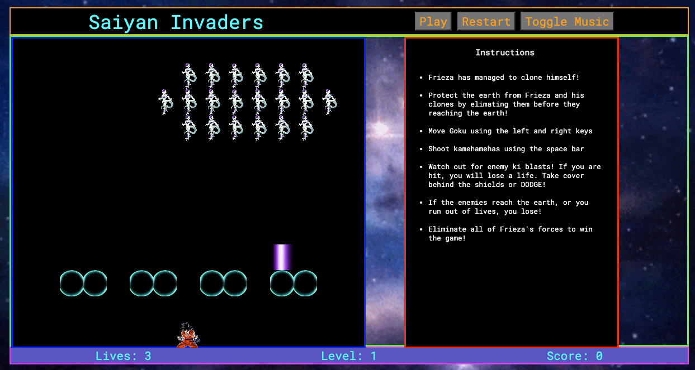

# Space-Invaders

☐ Title -> Saiyan Invaders. This is a Dragonball Z themed version of the popular Space Invaders aracade game which was originally released in 1978. The aim of the game is to move the shooter horizontally across the bottom of the screen and fire lasers at the aliens overhead. The aliens will move left and right during the game, shifting downward each time the reach a screen edge. The goal is to eliminate the aliens before they reach the bottom of the screen, or the player runs out of lives.

☐ Screenshot(s): Images of your actual game.

☐ Technologies Used: HTML, CSS, JavaScript. Wireframe built on Figma, project built using VS Code and deployed online on GitHub.

☐ Getting Started: In this section include the link to your deployed game and any instructions you deem important.
Link to the game - https://amritpalc.github.io/Space-Invaders/

Instructions - move the hero using the left and right arrow keys. Use the spacebar to shoot missiles at the aliens! You start with 3 lives and you win by eliminating all the aliens. Make sure to avoid alien missiles whlist you play. You will lose if the aliens reach the bottom of the screen - or you run out of lives.

☐ Next Steps: Planned future enhancements (icebox items).
- Levels - increase difficulty with faster alien movement &/ faster alien missiles. Fix restart function to allow levels implementation - perhaps with a class for the game itself
- Power ups - player missile speed boost / potential super move that eliminates all aliens
- Alien classes - more alien variety where the aliens could have varying health values - by way of size on the grid or using health values
- Bug - fix a classList bug which sometimes occurs when there is one alien left on the grid
- UI - enhdance thh UI and include the instructions on the landing screen. Would like to change the design layout from CSS Flexbox to CSS Grid
- Collision detection - could include this instead of using class names on the div cells to register missile hit detection

